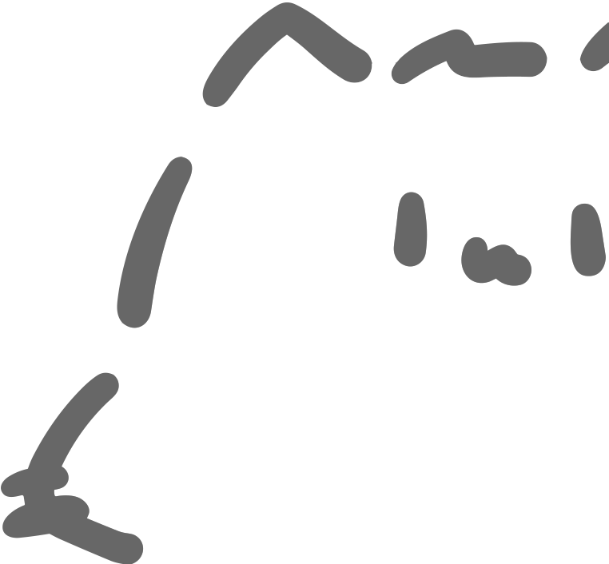

# 自己紹介のやつ

<style scoped>
  .subtitle {
    display: flex;
    align-items: center;

    .profile-icon {
      width: 1.6em;
      height: 1.6em;
      border: 2px solid var(--color-light-black);
      border-radius: 999px;
      margin-right: 18px;
    }

    .author {
      margin: 0;
      font-weight: normal;
    }
  }
</style>

<div class="subtitle">
  
  <p class="author">arrow2nd / あろー</p>
</div>

---

## 自己紹介

arrow2nd といいます。

[ちょっと株式会社](https://chot-inc.com/)でフロントエンドエンジニアとして働いています。

<style scoped>
  .neko {
    position: fixed;
    width: 320px;
    bottom: 0;
    right: 0;
  }
</style>



---

## はなすこと

1. ほげほげ
2. ふがふが

---

## セクションタイトル

---


---

```ts
console.log("Hello, World!");
```
